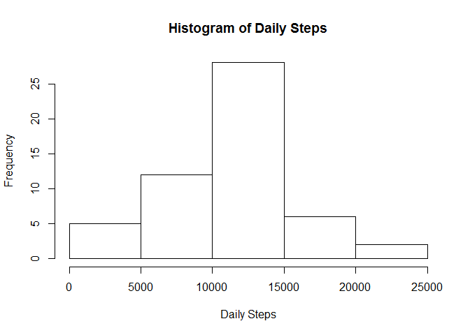
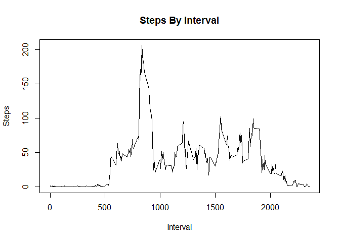
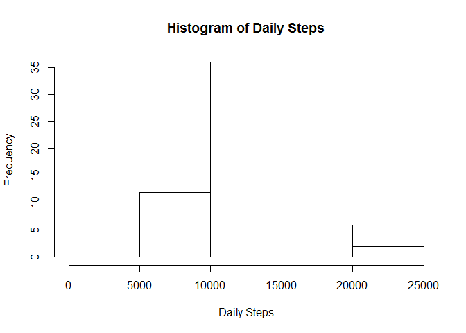
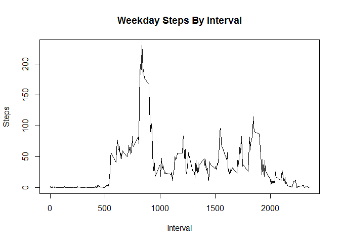
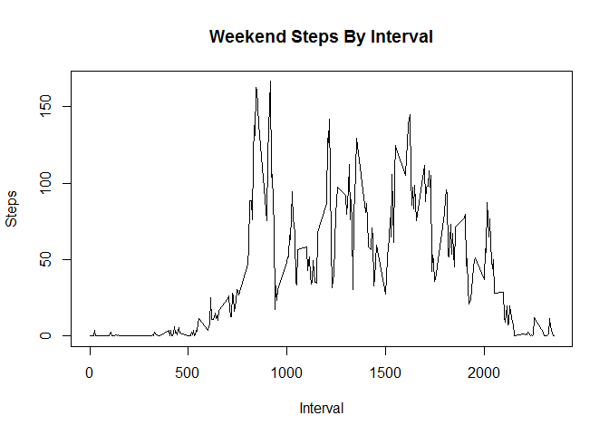

# PA1_template
Mike Cincotti  
Monday, January 12, 2015  

This is an R Markdown document analyzing the steps data within the Activity Monitoring Data. 

First we need to read in the data:

```r
stepdata <- read.csv("Activity.csv")
```

Now we want to look at some daily values. 

```r
library(plyr)
stepsbyday <- ddply(stepdata, "date", summarise,steps=sum(steps))
dailymean <- mean(stepsbyday$steps, na.rm=TRUE)
dailymedian <- median(stepsbyday$steps, na.rm=TRUE)
hist(stepsbyday$steps,xlab="Daily Steps",main="Histogram of Daily Steps")
```

 

The mean steps per day, excluding NA values, is 1.0766189\times 10^{4}. The median steps per day, excluding NA values, is 10765.

Now let's organize the data according to range and see which ranges had the most steps:


```r
stepsbyinterval <- ddply(stepdata, "interval", summarise,steps=mean(steps,na.rm=TRUE))
highestinterval <- stepsbyinterval[which.max(stepsbyinterval$steps),1]
plot(stepsbyinterval$interval,stepsbyinterval$steps,type="l",xlab="Interval",ylab="Steps",main="Steps By Interval")
```

 

The interval with the most steps is 835.

Now we're going to deal with all of those NA values. Whenever there is a row with "NA", we're going to fill in the value with the step count with the mean value for that interval. Once we do that, we'll look at the same histogram from earlier with the new data set.

```r
filledsteps <- stepdata
nacount <- sum(is.na(filledsteps$steps))
for ( i in seq_along(filledsteps$steps)){
    if ( is.na(filledsteps[i,1])){
        interval <- filledsteps[i,3]
        filledsteps[i,1] <- round(stepsbyinterval[match(interval,stepsbyinterval$interval),2],0)
    }
}

filledstepsdaily <- ddply(filledsteps, "date", summarise,steps=sum(steps))
newdailymean <- mean(filledstepsdaily$steps, na.rm=TRUE)
newdailymedian <- median(filledstepsdaily$steps, na.rm=TRUE)
hist(filledstepsdaily$steps,xlab="Daily Steps",main="Histogram of Daily Steps")
```

 

There were 2304 NA values in the original data. With the new data, the mean is 1.0765639\times 10^{4} (compared to 1.0766189\times 10^{4} from above) and the median is 1.0762\times 10^{4} (compared to 10765 from above).

Now let's split the data between weekdays and weekends.

```r
library(lubridate)
isweekend <- function(x){
    thisdate <- ymd(as.character(x))
    thisday <- weekdays(thisdate)
    returnval <- "weekday"
    if ( thisday == "Saturday" || thisday == "Sunday" ){
        returnval <- "weekend"
    }
    returnval
}
for ( j in seq_along(filledsteps$date)){
     filledsteps[j,4] <- as.character(isweekend(filledsteps[j,2]))
}
weekendsteps <- subset(filledsteps,filledsteps[,4]=="weekend")
weekendsteps <- ddply(weekendsteps, "interval", summarise,steps=mean(steps,na.rm=TRUE))
weekdaysteps <- subset(filledsteps,filledsteps[,4]=="weekday")
weekdaysteps <- ddply(weekdaysteps, "interval", summarise,steps=mean(steps,na.rm=TRUE))
plot(weekdaysteps$interval,weekdaysteps$steps,type="l",xlab="Interval",ylab="Steps",main="Weekday Steps By Interval")
```

 

```r
plot(weekendsteps$interval,weekendsteps$steps,type="l",xlab="Interval",ylab="Steps",main="Weekend Steps By Interval")
```

 

